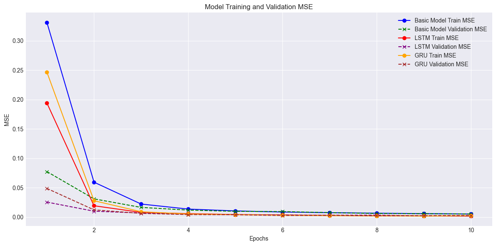

# Scattering Parameters Parameterization 

## Introduction

**Research Focus:**
- Inverse problem: given dataset $\rightarrow$ input parameters.
- Simulated microwave transmission data originally used to detect intracranial bleeding after trauma or stroke 

*Sixteen antennas were placed around the head model used in the simulations.*

[Dataset](https://www.kaggle.com/datasets/rajathrpai/scattering-parameters)

**Dataset Description:**
- Scattering parameters (S-parameters) for antenna pairs.
- 1000 pre-simulated healthy samples 
- S-parameters from 16 antennas $\rightarrow$ 136 complex-valued curves.
- Antennas 2, 6, 7, 11, and 14 are utilized as amplitude components.

*S-parameter $S_{26}$ representing coupling between antennas 2 & 6 for three samples from the dataset.*

**Input Parameters:**
- Rescaling of head in the x, y, & z dimensions.
- Variation in hair layer thickness.

## Method

**Three Models Employed:**
1. Basic Feedforward Neural Network 
2. RNN incorporating a Long Short-Term Memory (LSTM) 
3. RNN incorporating a Gated Recurrent Unit (GRU) 

**Shared Network Settings:**
- Data split: 80% training & 20% validation.
- Optimizer: Adam 
- Loss function: mean squared error (MSE) 
- Epochs: 10.
- Batch size: 32.

**Multiple Train-Test Splits:**
- Iterations: 5.
- Validation with Average MSE & standard deviation.

## Results -- Single Train-Test Splits

### Example of Predicted & True Label of Different Models

| Label   |     X |     Y |     Z |  Hair |
|:-------:|------:|------:|------:|------:|
| Predicted Basic | 0.827 | 0.848 | 0.796 | 0.938 |
| Predicted LSTM  | 0.840 | 0.837 | 0.814 | 1.094 |
| Predicted GRU   | 0.862 | 0.812 | 0.852 | 0.973 |
| True           | 0.844 | 0.851 | 0.834 |   1.0 |

*Training & Validation Results for Different Models*

Certainly, here's the information organized into tables:

### Training & Validation Results for Different Models

| Metric                 | Basic | LSTM  | GRU   |
|------------------------|-------|-------|-------|
| Training -- 1st Epoch  | 0.3311| 0.1941| 0.2465|
| Validation -- 1st Epoch| 0.0774| 0.0256| 0.0488|
| Training -- 10th Epoch | 0.0053| 0.0017| 0.0024|
| Validation -- 10th Epoch| 0.0054| 0.0019| 0.0030|

| Metric                 | Basic | LSTM  | GRU   |
|------------------------|-------|-------|-------|
| Average Euclidean Distance | 0.1219 | 0.0703 | 0.0925 |

## Results -- Multiple Train-Test Splits

*Validation of Multiple Train-Test Splits*

| Model | Average MSE for 5 Splits | Standard Deviation |
|-------|--------------------------|--------------------|
| Basic | 0.0059                   | 0.0021              |
| LSTM  | 0.0052                   | 0.0016              |
| GRU   | 0.0048                   | 0.0007              |

- Final result: GRU outperforms LSTM and Basic Model

## Prospective Research

- Utilize data from all 16 antennas.
- Dataset contains bleeding samples $\rightarrow$ incorporate these samples.
- Explore data augmentation & transformers.

## References

- [Fhager, A. (2003). Microwave-Based Detection of Traumatic Intracranial Hematomas.](https://www.diva-portal.org/smash/record.jsf?pid=diva2%3A1338250&dswid=-6717)
- [Goodfellow, I., Bengio, Y., Courville, A., & Bengio, Y. (2016). Deep Learning (Vol. 1). MIT press Cambridge.](http://www.deeplearningbook.org/)
